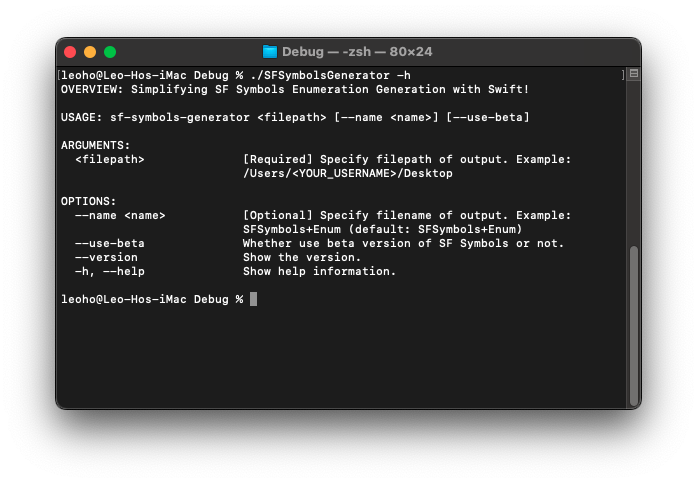

# SFSymbolsGenerator

Simplifying SF Symbols Enumeration Generation with Swift!

## Currently Support States

* Support SF Symbols 5

## Minimum OS Requirement

* macOS Ventura 13.0 (Compatible with Intel and Apple Silicon-based Macs)

## How to Use



1. Download binary file from Latest Releases
2. Open Terminal.app (notes: check current path exists SFSymbolsGenerator binary file!)
3. run ```./SFSymbolsGenerator <filepath>```, and Happy use it!

#### Argument

| Argument   | Description                 | Required or Optional |
|------------|-----------------------------| :------------------: |
| filepath   | Specify filepath of output. | **Required**         |

#### Flag

| Argument   | Description                 | Required or Optional |
|------------|-----------------------------| :------------------: |
| --name     | Specify filename of output. | **Optional**         |

#### Flag

| Argument   | Description         | Required or Optional |
|------------|---------------------| :------------------: |
| --use-beta | Use SF Symbols beta | **Optional**         |

##### Example

```shell
# Normal Usage
./SFSymbolsGenerator /Users/leoho/Desktop

# Specify filename Usage
./SFSymbolsGenerator /Users/leoho/Desktop --name SFSymbols

# beta version Usage
./SFSymbolsGenerator /Users/leoho/Desktop --use-beta
```

## Thanks

1. <https://github.com/jollyjinx/SFSymbolEnum>
